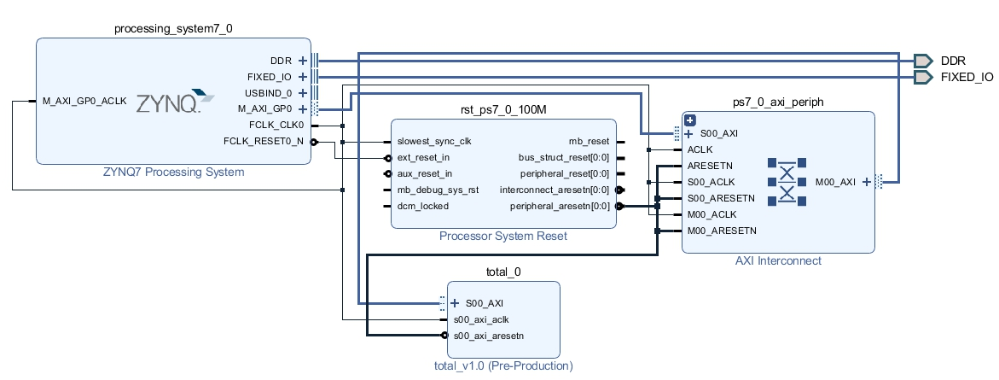
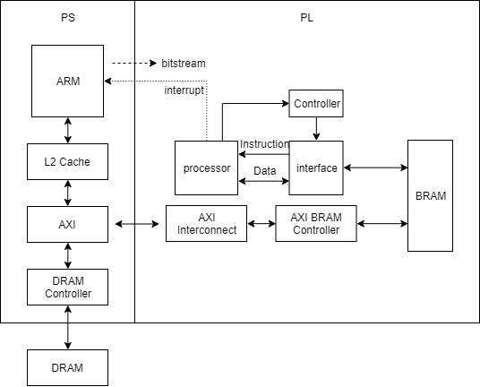
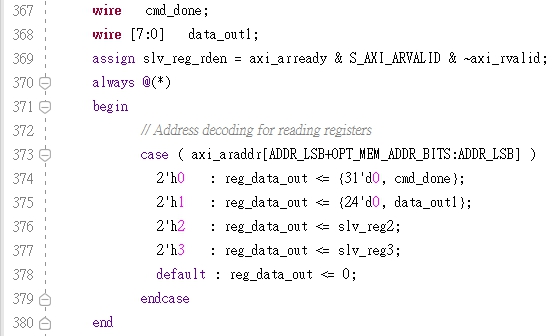
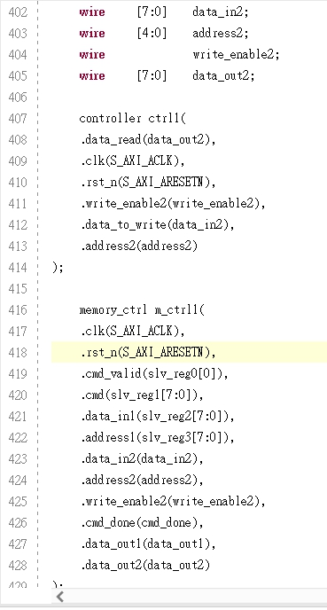
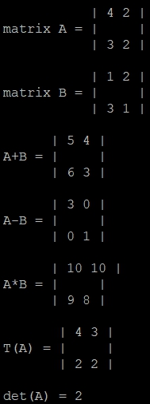

# FPGA Design Lab05 - Block RAM
## 組員
E24056027 洪偉庭
E24056726 高士鈞
E24056483 謝明穎
## Block design

## System Architecture

系統架構圖參考助教所提供的架構圖，如下圖，因此電路並不複雜，故將圖中的controller、interface、processor整合成一個module，並將此module與bram以及bram_ctrl一併包成AXI4 IP

## IP introduce

AXI IP的名稱為total_v1

其中所用到共有五個module，其關係圖如下：

以下分別為各個module作簡單介紹

* total_v1_0.v

AXI4 IP自動生成的module，因為沒有額外的input output腳位，故沒有更動此module

* total_v1_0_S00_AXI.v

改動的部分如下圖

* controller.v

包含狀態機、運算單元、控制單元所整合的module

* memory_ctrl.v

使用Lab中所提供的ctrl，並從clk_4_f負緣觸發，修改為clk正緣觸發，與controller.v為同步關係，防止dual-port block ram存取衝突發生

* mem32X8.v
將block ram改寫成dual-port，提供兩組讀寫端口，其中bram中記憶體位置分配為：0 ~ 3為第一個矩陣的輸入(由左而右，由上而下)、4 ~ 7為第二個矩陣的輸入(由左而右，由上而下)、
8 ~ 11為+,-,*,traspose運算結果儲存的地方(由左而右，由上而下)、12以及13存放determinant的值，14為儲存Instrction的指令、15為memory status flag

其中Instruction：11(b)代表+，12(c)代表-，13(d)代表*，14(e)代表transpose，15(f)代表determinant

又memory status flag：0代表Idle，1代表PS using，2代表PS done，3代表PL using，4代表PL done

因為本bram每個位置為8bits大小，為了簡單實作矩陣的運算，因此數字運算範圍限制為0~255，若超出此範圍會有overflow等問題，會顯示錯誤結果

## System Flow

1.PS have some matrix operation to do

2.PS ensure memory is not used，which means mem[15] = 0 (Idle)

3.PS write the memory status mem[15] = 1 (PS using)

4.PS write the data to mem[0]~mem[7], and instrction to mem[14]

5.PS write the memory status mem[15] = 2 (PS done)

6.PL ensure PS finish writing data，which means mem[15] = 2 (PS done)

7.PL write the memory status mem[15] = 3 (PL using)

8.PL read the data from mem[0]~mem[7], and instrction from mem[14]

9.PL calculation

10.PL write the calculation result to mem[8]~mem[13]

11.PL write the memory status mem[15] = 4 (PL done)

12.PS ensure PL finish calculating and writing result，which means mem[15] = 4 (PL done)

13.PS read the result from mem[8]~mem[13]

14.PS reset memory status flag mem[15] = 0 (Idle)，and return to step 1.

## Lab Result

